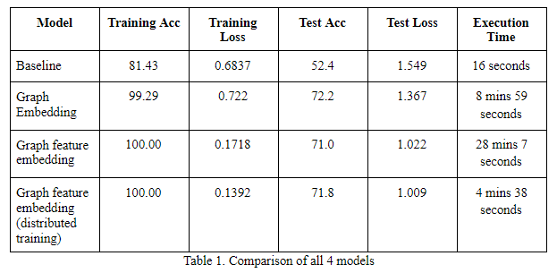

# Distributed Training with Graph Neural Networks
The objective of this project is to implement distributed training on Graph Neural Networks (GNN). Introduced in 2009, GNNs have become a popular model for representing real time dynamic models especially in areas like computer vision, molecular chemistry and biology, pattern recognition, etc where the data when represented as a graph proved to produce startling results.

However given the architecture of GNNs, training a GNN takes a very long time when done sequentially. Through this project, the authors are attempting to mitigate this issue by introducing distributed computing wherein functionally independent segments of the network can be processed parallely to save on computation time given the system has proper distributed computing support.

### Graph Neural Network models 
For more information checkout https://github.com/CVxTz/graph_classification

#### Baseline ANN model
We first experiment with the simplest model that learn to predict node classes using only the binary features and discarding all graph information.
This model is a fully-connected Neural Network that takes as input the binary features and outputs the class probabilities for each node.

#### Graph Embedding Model
We add pretrained embeddings to the node classification making a graphical network as the input. This helps significantly improve the classification accuracy compared to the baseline model. We can look to further improve the previous model by pushing the pre-training further and using the binary features in the node embedding network and reusing the pre-trained weights from the binary features in addition to the node embedding vector. This results in a model that relies on more useful representations of the binary features learned from the graph structure.

### Distributed Training of Graph Neural Network
#### Mirrored Strategy
In synchronous training, all of the devices train their local model using different parts of data from a single (large) mini-batch. They then communicate their locally calculated gradients (directly or indirectly) to all devices. Synchronous training across multiple replicas on one machine is called Mirrored Strategy . This strategy is typically used for training on one machine with multiple GPUs. For TPUs, use tf.distribute.TPUStrategy. To use MirroredStrategy with multiple workers, please refer to tf.distribute.experimental.MultiWorkerMirroredStrategy. For example, a variable created under a MirroredStrategy is a MirroredVariable. If no devices are specified in the constructor argument of the strategy then it will use all the available GPUs. If no GPUs are found, it will use the available CPUs. Note that TensorFlow treats all CPUs on a machine as a single device, and uses threads internally for parallelism.

For more information: [Tensorflow Docs](https://www.tensorflow.org/api_docs/python/tf/distribute/MirroredStrategy)

### How to run the code
* Download the [CORA Dataset](https://linqs.soe.ucsc.edu/data) and save it in a folder named **input**
* **python eda.py** to visualise dataset as a graph network
* **python word_features_only.py** for basic ANN model (accuracy ~ 52.4%)
* **python graph_embedding.py** for binary features used as graph network information model (accuracy ~72.2%)
* **python graph_feature_embedding.py** for pretrained binary features used as graph network information model (accuracy ~71.0%)
* **python distributed_graph_feature_embedding.py** for training the model with a distributed mirrored strategy (accuracy ~71.8%)

### Results

